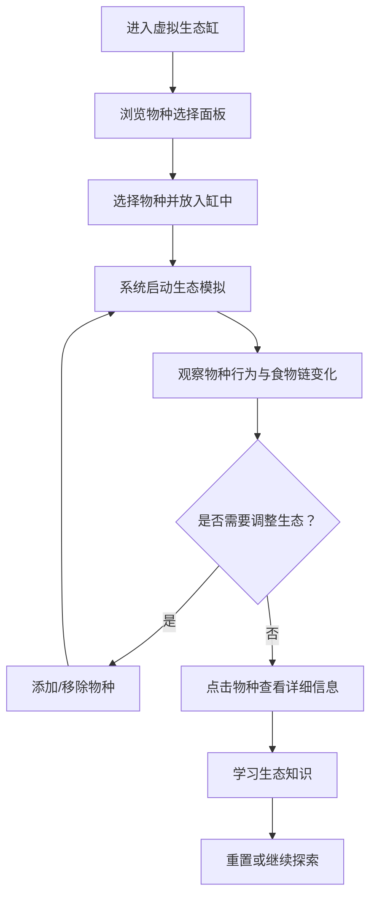

## 1. 产品概述
面向中小学自然观察课的3D虚拟生态缸教学工具，学生可通过放置不同物种并实时观察食物链变化与生态平衡关系。
- 主要目标：让学生直观理解生态系统、食物链、能量流动等生物学概念
- 目标用户：中小学学生（8-15岁）、自然课教师
- 产品价值：将抽象的生态概念转化为可视化、可交互的沉浸式学习体验

## 2. 核心功能

### 2.1 用户角色
| 角色 | 注册方式 | 核心权限 |
|------|----------|----------|
| 学生用户 | 无需注册，直接使用 | 放置物种、观察生态变化、查看物种信息 |
| 教师用户 | 无需注册，直接使用 | 所有学生功能，可用于课堂演示 |

### 2.2 功能模块
1. **主场景页面**：3D生态缸场景、物种展示区、控制面板
2. **物种选择面板**：分类展示可放置的物种（植物/草食动物/肉食动物/分解者）
3. **食物链可视化**：实时显示当前生态系统的食物网关系图
4. **生态数据面板**：展示种群数量、能量流动、生态平衡状态
5. **物种信息卡片**：点击物种后显示其详细生物学信息

### 2.3 页面详情
| 页面名称 | 模块名称 | 功能描述 |
|----------|----------|----------|
| 主场景页面 | 3D生态缸 | 可旋转/缩放的玻璃缸体，包含水体、底砂、光照环境 |
| 主场景页面 | 物种工具栏 | 左右侧分类展示可放置的物种图标，点击选中后可放入缸中 |
| 主场景页面 | 食物链面板 | 右下角实时显示当前物种构成的食物网关系图 |
| 主场景页面 | 生态数据面板 | 左下角显示各物种种群数量、出生率/死亡率、平衡指数 |
| 主场景页面 | 物种信息卡 | 点击缸中物种后弹出，显示名称、习性、天敌、食物等信息 |
| 主场景页面 | 控制按钮 | 开始/暂停模拟、重置生态缸、切换视角、开启/关闭标签 |

## 3. 核心流程
学生进入页面后，先浏览可选物种列表，选择感兴趣的物种放入生态缸中。系统自动根据食物链规则开始模拟生态变化：草食动物吃植物、肉食动物捕食草食动物、种群数量动态变化。学生可随时观察食物网的形成与演化，点击任意物种查看详细信息，并通过添加/移除物种来探索生态平衡的规律。

## 4. 用户界面设计

### 4.1 设计风格
- **主色调**：深海蓝渐变（#0A1628 → #1E3A5F）作为背景，生态绿（#4ADE80）和阳光橙（#FBBF24）作为强调色
- **辅助色**：水体青（#22D3EE）、珊瑚粉（#F472B6）用于区分不同营养级
- **按钮风格**：圆角胶囊按钮，带微玻璃拟态效果和悬浮发光
- **字体**：标题使用圆润可爱的"ZCOOL KuaiLe"，正文使用清晰的"Noto Sans SC"
- **布局风格**：中央为3D场景主体，四周浮动半透明控制面板，营造沉浸式科学实验室氛围
- **图标风格**：使用emoji + 简约线条图标组合，生动有趣适合中小学生

### 4.2 页面设计概览
| 页面名称 | 模块名称 | UI元素 |
|----------|----------|--------|
| 主场景页面 | 3D生态缸 | 玻璃反光材质、动态水体焦散、柔和环境光、可拖拽旋转 |
| 主场景页面 | 物种工具栏 | 左右两侧垂直排列的圆形物种卡片，带悬浮放大动画 |
| 主场景页面 | 食物链面板 | 节点连接线动画、颜色编码营养级、脉冲效果指示能量流动 |
| 主场景页面 | 生态数据面板 | 数字跳动动画、进度条展示种群占比、平衡状态指示灯 |
| 主场景页面 | 物种信息卡 | 弹出动画、emoji大图、科普文字分条展示 |
| 主场景页面 | 控制按钮 | 顶部居中排列，图标+文字，点击反馈动画 |

### 4.3 响应式
- 桌面端优先设计，适配1280px及以上屏幕
- 平板端自动调整控制面板大小，物种工具栏改为可折叠
- 触摸设备支持手势旋转/缩放场景

### 4.4 3D场景指导
- **环境与氛围**：深海蓝渐变背景配合柔光，模拟自然教室中的观察台氛围；缸体内部呈现清澈的水下世界
- **光照设置**：顶部主光源模拟阳光穿透水面，缸内补光营造通透感，使用HDR环境贴图增加真实感
- **相机设置**：默认45度俯视角度，支持鼠标拖拽旋转、滚轮缩放，设置合理的近远裁剪面
- **构图与焦点**：生态缸位于画面中心，占主视觉区域60%，控制面板环绕四周不遮挡主体
- **交互动画**：物种放入缸中的弹跳动画、生物游动/摆动的循环动画、捕食时的追逐动画
- **后处理效果**：轻微泛光（Bloom）增强水体通透感，屏幕空间反射（SSR）模拟玻璃质感
- **资源来源与性能**：所有3D模型使用Three.js程序化生成（低面数几何体+卡通材质），确保在普通教室电脑流畅运行（目标60fps）
