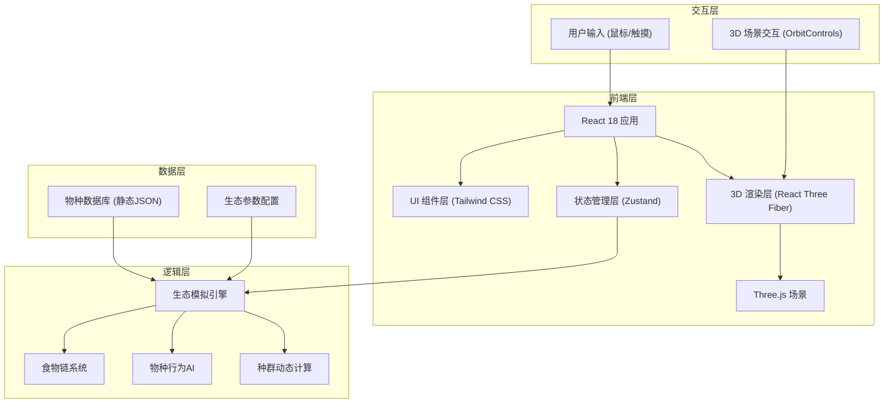
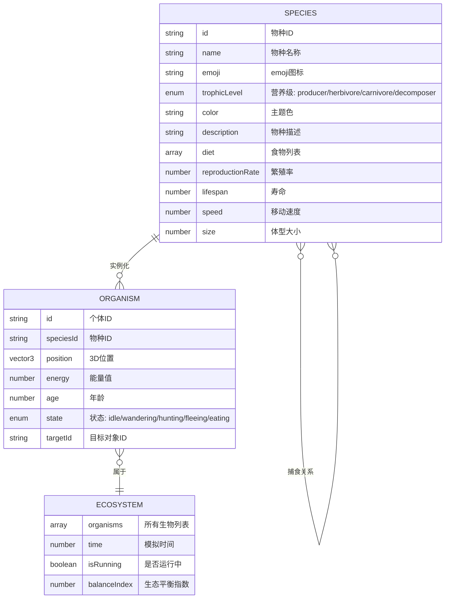

## 1. 架构设计



## 2. 技术说明
- **前端框架**：React@18 + TypeScript + Vite
- **样式方案**：Tailwind CSS@3
- **3D渲染**：three@^0.160.0 + @react-three/fiber@^8.15.0 + @react-three/drei@^9.92.0 + @react-three/postprocessing@^2.15.0
- **状态管理**：zustand@^4.4.0
- **图标库**：lucide-react
- **初始化工具**：vite-init
- **后端**：无（纯前端单页应用，所有逻辑在浏览器端运行）
- **数据**：内置静态物种数据与生态配置

## 3. 路由定义
| 路由 | 用途 |
|------|------|
| / | 主场景页面，包含3D生态缸与所有控制面板 |

## 4. 数据模型

### 4.1 数据模型定义



### 4.2 物种数据定义

```typescript
// 物种类型定义
type TrophicLevel = 'producer' | 'herbivore' | 'carnivore' | 'decomposer';

interface Species {
  id: string;
  name: string;
  emoji: string;
  trophicLevel: TrophicLevel;
  color: string;
  description: string;
  habitat: 'water' | 'land' | 'both';
  diet: string[];
  predators: string[];
  reproductionRate: number;
  lifespan: number;
  speed: number;
  size: number;
  energyValue: number;
  maxPopulation: number;
}

// 预设物种列表
const SPECIES: Species[] = [
  // 生产者
  {
    id: 'seaweed',
    name: '海藻',
    emoji: '🌿',
    trophicLevel: 'producer',
    color: '#4ADE80',
    description: '海洋中最常见的植物，通过光合作用制造能量，是许多草食动物的食物来源。',
    habitat: 'water',
    diet: [],
    predators: ['fish', 'turtle'],
    reproductionRate: 0.03,
    lifespan: 200,
    speed: 0,
    size: 0.8,
    energyValue: 30,
    maxPopulation: 15,
  },
  {
    id: 'grass',
    name: '水草',
    emoji: '🌱',
    trophicLevel: 'producer',
    color: '#86EFAC',
    description: '生长在水底的绿色植物，为小型动物提供食物和庇护。',
    habitat: 'water',
    diet: [],
    predators: ['fish', 'snail'],
    reproductionRate: 0.04,
    lifespan: 150,
    speed: 0,
    size: 0.5,
    energyValue: 20,
    maxPopulation: 20,
  },
  // 草食动物
  {
    id: 'fish',
    name: '小鱼',
    emoji: '🐟',
    trophicLevel: 'herbivore',
    color: '#22D3EE',
    description: '活泼的小型鱼类，以藻类和水草为食，同时也是大型捕食者的猎物。',
    habitat: 'water',
    diet: ['seaweed', 'grass'],
    predators: ['bigfish', 'frog'],
    reproductionRate: 0.015,
    lifespan: 300,
    speed: 0.04,
    size: 0.5,
    energyValue: 50,
    maxPopulation: 12,
  },
  {
    id: 'snail',
    name: '田螺',
    emoji: '🐌',
    trophicLevel: 'herbivore',
    color: '#D4A574',
    description: '行动缓慢的软体动物，喜欢啃食水草表面的藻类。',
    habitat: 'water',
    diet: ['grass', 'seaweed'],
    predators: ['frog'],
    reproductionRate: 0.01,
    lifespan: 400,
    speed: 0.008,
    size: 0.35,
    energyValue: 35,
    maxPopulation: 10,
  },
  {
    id: 'turtle',
    name: '乌龟',
    emoji: '🐢',
    trophicLevel: 'herbivore',
    color: '#65A30D',
    description: '长寿的爬行动物，动作虽慢但很有智慧，喜欢吃海藻和水草。',
    habitat: 'both',
    diet: ['seaweed', 'grass'],
    predators: ['bigfish'],
    reproductionRate: 0.005,
    lifespan: 800,
    speed: 0.015,
    size: 0.7,
    energyValue: 80,
    maxPopulation: 4,
  },
  // 肉食动物
  {
    id: 'bigfish',
    name: '大鱼',
    emoji: '🐠',
    trophicLevel: 'carnivore',
    color: '#F472B6',
    description: '水域中的捕食者，以小鱼为食，处于食物链的较高层级。',
    habitat: 'water',
    diet: ['fish', 'turtle'],
    predators: [],
    reproductionRate: 0.005,
    lifespan: 500,
    speed: 0.05,
    size: 0.9,
    energyValue: 100,
    maxPopulation: 3,
  },
  {
    id: 'frog',
    name: '青蛙',
    emoji: '🐸',
    trophicLevel: 'carnivore',
    color: '#A3E635',
    description: '两栖动物，灵活敏捷，喜欢捕食小鱼和田螺。',
    habitat: 'both',
    diet: ['fish', 'snail'],
    predators: ['bigfish'],
    reproductionRate: 0.008,
    lifespan: 350,
    speed: 0.035,
    size: 0.5,
    energyValue: 60,
    maxPopulation: 5,
  },
  // 分解者
  {
    id: 'bacteria',
    name: '分解菌',
    emoji: '🦠',
    trophicLevel: 'decomposer',
    color: '#C084FC',
    description: '微小的分解者，将死亡的有机体分解为养分，供植物重新吸收利用。',
    habitat: 'water',
    diet: [],
    predators: [],
    reproductionRate: 0.02,
    lifespan: 100,
    speed: 0.002,
    size: 0.2,
    energyValue: 5,
    maxPopulation: 8,
  },
];
```

## 5. 项目目录结构

```
src/
├── components/
│   ├── Aquarium3D/          # 3D生态缸相关组件
│   │   ├── Aquarium.tsx     # 缸体容器组件
│   │   ├── Water.tsx        # 水体效果
│   │   ├── Glass.tsx        # 玻璃材质
│   │   ├── Substrate.tsx    # 底砂
│   │   └── Lighting.tsx     # 光照系统
│   ├── Organisms/           # 生物组件
│   │   ├── Organism.tsx     # 单个生物3D组件
│   │   ├── Producer.tsx     # 植物模型
│   │   ├── Herbivore.tsx    # 草食动物模型
│   │   └── Carnivore.tsx    # 肉食动物模型
│   ├── UI/                  # UI控制面板
│   │   ├── SpeciesToolbar.tsx    # 物种选择工具栏
│   │   ├── FoodWebPanel.tsx      # 食物链可视化
│   │   ├── EcosystemStats.tsx    # 生态数据面板
│   │   ├── SpeciesInfoCard.tsx   # 物种信息卡片
│   │   └── ControlButtons.tsx    # 顶部控制按钮
│   └── common/              # 通用UI组件
│       └── GlassCard.tsx    # 玻璃拟态卡片
├── hooks/
│   ├── useEcosystem.ts      # 生态模拟Hook
│   ├── useOrganismAI.ts     # 生物行为AI Hook
│   └── useFoodChain.ts      # 食物链计算Hook
├── store/
│   └── useEcosystemStore.ts # Zustand状态管理
├── types/
│   └── ecosystem.ts         # 类型定义
├── data/
│   └── species.ts           # 物种数据
├── utils/
│   ├── ecosystemSimulator.ts # 生态模拟核心算法
│   ├── foodChain.ts         # 食物链关系计算
│   └── threeHelpers.ts      # Three.js辅助函数
├── pages/
│   └── MainPage.tsx         # 主页面
├── App.tsx
├── main.tsx
└── index.css
```
